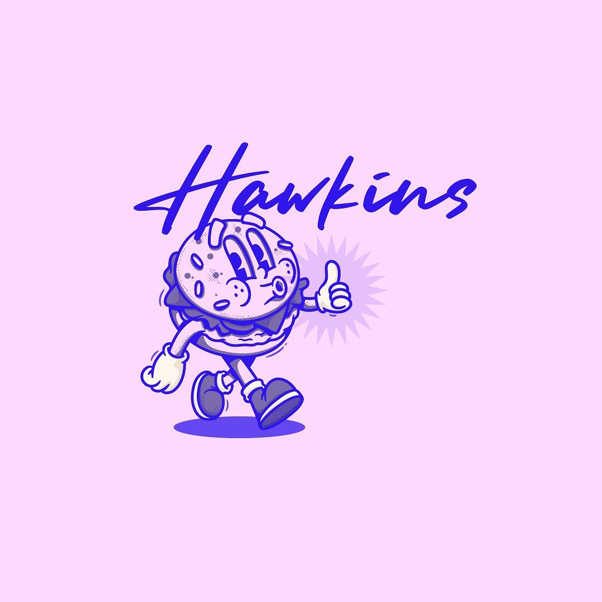

# 🍔 Hawkins Hamburgueria

<div align="center">



**🌃 Vice City Themed Restaurant Website**

*Authentic 80s neon aesthetic meets modern web technology*

[](https://reactjs.org/)
[](https://www.typescriptlang.org/)
[](https://vitejs.dev/)
[](https://supabase.com/)
[](https://tailwindcss.com/)

</div>

## ✨ Features

- 🎨 **Vice City Theme** - Authentic 80s neon aesthetics with glowing effects
- 🍔 **Dynamic Menu** - Real-time menu loaded from Supabase database
- 📱 **Fully Responsive** - Optimized for mobile, tablet, and desktop
- ⚡ **Lightning Fast** - Built with Vite for optimal performance
- 🔒 **Type Safe** - Full TypeScript implementation
- 🎯 **Modern Architecture** - Feature-based structure for scalability

## 🏗️ Tech Stack

### Frontend
- **React 18** - Modern UI library with hooks
- **TypeScript** - Type-safe development
- **Vite** - Next-generation build tool
- **TailwindCSS** - Utility-first styling
- **React Router** - Client-side routing

### Backend & Database
- **Supabase** - PostgreSQL database with real-time features
- **Row Level Security** - Secure data access policies
- **REST API** - Auto-generated from database schema

### Design System
- **Radix UI** - Accessible component primitives
- **Lucide Icons** - Beautiful, consistent iconography
- **Custom Neon Effects** - Vice City inspired glows and animations

## 🚀 Quick Start

### Prerequisites
- Node.js 18+ 
- npm or yarn
- Supabase account

### Installation

1. **Clone the repository**
   ```bash
   git clone https://github.com/NapMarian/Hawking-Hamburgueseria.git
   cd Hawking-Hamburgueseria
   ```

2. **Install dependencies**
   ```bash
   npm install
   ```

3. **Environment Setup**
   
   Create `.env.local` file:
   ```env
   VITE_SUPABASE_URL=your_supabase_project_url
   VITE_SUPABASE_ANON_KEY=your_supabase_anon_key
   ```

4. **Database Setup**
   
   Run this SQL in your Supabase SQL Editor:
   ```sql
   -- Create tables and sample data
   -- (See supabase/schema.sql for complete setup)
   ```

5. **Start Development Server**
   ```bash
   npm run dev
   ```

## 📁 Project Structure

```
src/
├── app/                    # Application-level configuration
│   ├── App.tsx            # Main application component
│   └── store/             # Redux store configuration
├── features/              # Feature modules
│   ├── menu/              # Menu display and filtering
│   ├── cart/              # Shopping cart feature
│   ├── orders/            # Order management
│   └── admin/             # Admin panel functionality
├── pages/                 # Route-level page components
├── shared/                # Shared utilities and components
│   ├── components/        # Reusable UI components
│   ├── hooks/             # Custom React hooks
│   ├── lib/               # External service integrations
│   ├── types/             # TypeScript type definitions
│   └── utils/             # Helper functions and constants
└── styles/                # Global styles and theme
```

## 🎨 Design Philosophy

**Vice City Aesthetic** - Inspired by 1980s neon culture:
- 🌈 **Neon Color Palette** - Hot pink, electric blue, cyan accents
- ✨ **Glowing Effects** - CSS-powered neon text and borders
- 🌃 **Dark Theme** - Deep backgrounds for contrast
- 🎯 **High Contrast** - Optimized for readability

## 📱 Screenshots

### Desktop View


### Mobile View


## 🛠️ Development

### Available Scripts

- `npm run dev` - Start development server with hot reload
- `npm run build` - Build for production
- `npm run preview` - Preview production build locally
- `npm run lint` - Run ESLint for code quality

### Development Workflow

1. **Feature Development** - Each feature has its own directory
2. **Component Creation** - Use shared components when possible
3. **Type Safety** - Define interfaces in `types/` directories
4. **Styling** - Use TailwindCSS with custom neon classes

## 🗄️ Database Schema

### Core Tables

**menu_items**
- `id` - Unique identifier
- `name` - Item name
- `description` - Item description
- `price` - Price in decimal
- `category` - Item category
- `image_url` - Product image path
- `available` - Availability status

**orders**
- `id` - Unique identifier
- `customer_*` - Customer information
- `items` - Order items (JSONB)
- `total_amount` - Order total
- `status` - Order status
- `order_type` - Takeaway or delivery

## 🚀 Deployment

### Production Build

```bash
npm run build
```

### Deploy to Vercel

1. Connect your GitHub repository to Vercel
2. Add environment variables in Vercel dashboard
3. Deploy automatically on push to main branch

## 🤝 Contributing

1. Fork the repository
2. Create a feature branch (`git checkout -b feature/amazing-feature`)
3. Commit your changes (`git commit -m 'Add amazing feature'`)
4. Push to the branch (`git push origin feature/amazing-feature`)
5. Open a Pull Request

## 📄 License

This project is licensed under the MIT License - see the [LICENSE](LICENSE) file for details.

## 👤 Author

**Marian** - [GitHub](https://github.com/NapMarian)

---

<div align="center">

**🍔 Built with passion for great burgers and clean code 🍔**

*Serving digital experiences since 2024*

</div>